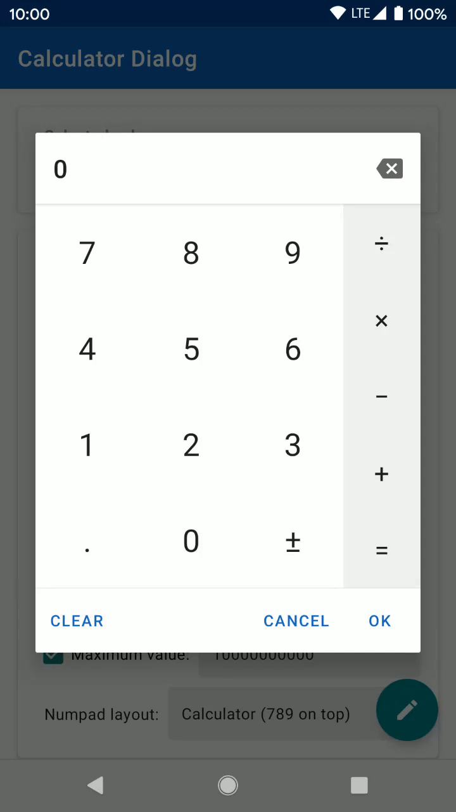

# Calculator dialog

A fully customizable calculator dialog for Android compatible with API 14.
Can be used to replace the numeric keyboard and useful to enter monetary amounts for example.

 

#### Features
- Material design with Google Material Components.
- Customizable number format.
- Calculator or phone numpad layout styles.
- Entered expression can be shown and edited.
- Optional answer button to reuse previous result.
- Order of operations can be applied or not.
- Expression can be evaluated on new operator or not.
- Optional clear button.
- Entirely customizable using custom attributes.

